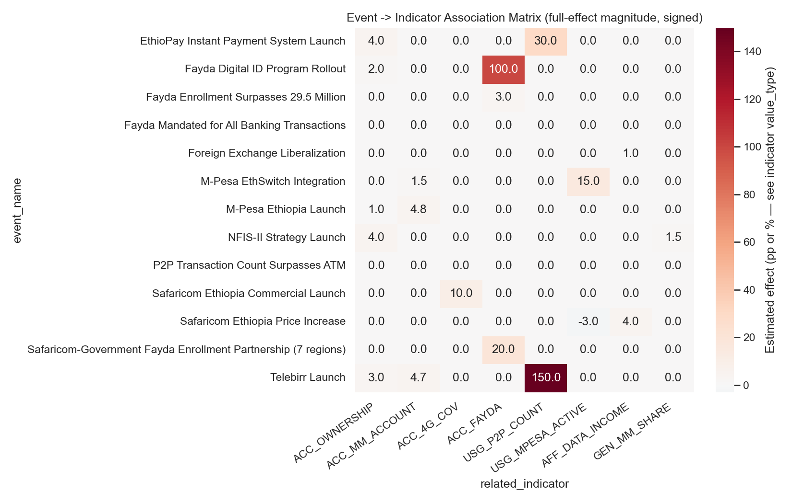
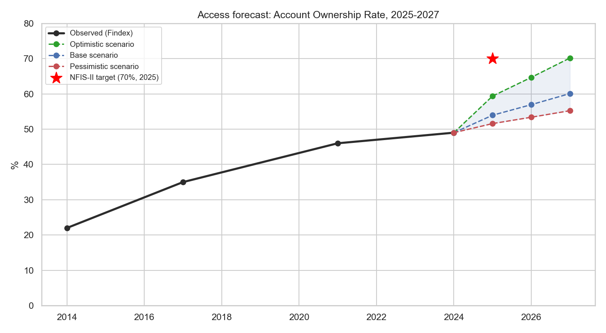
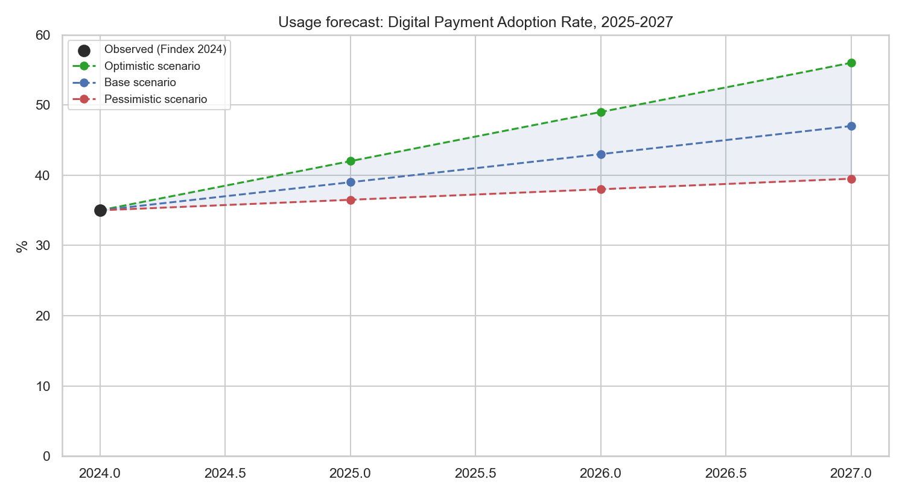
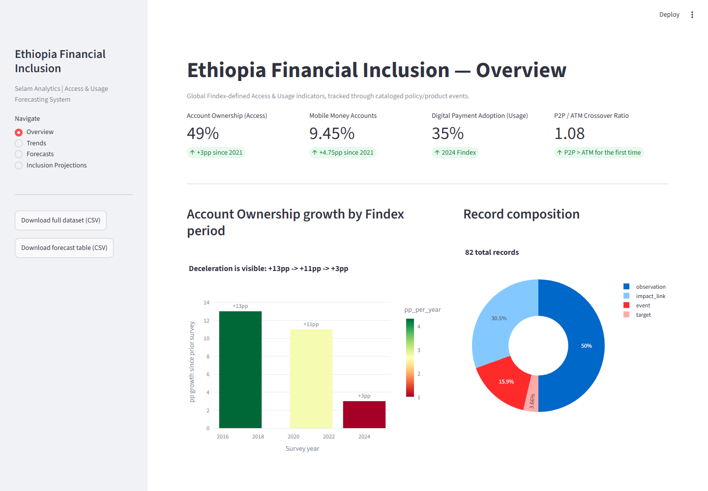
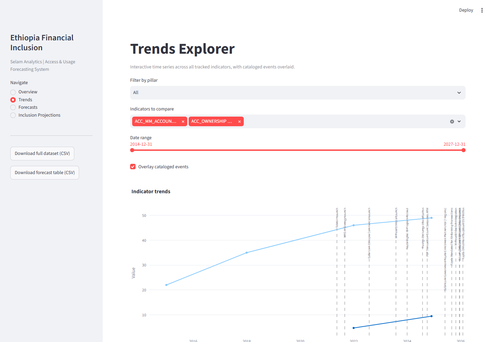
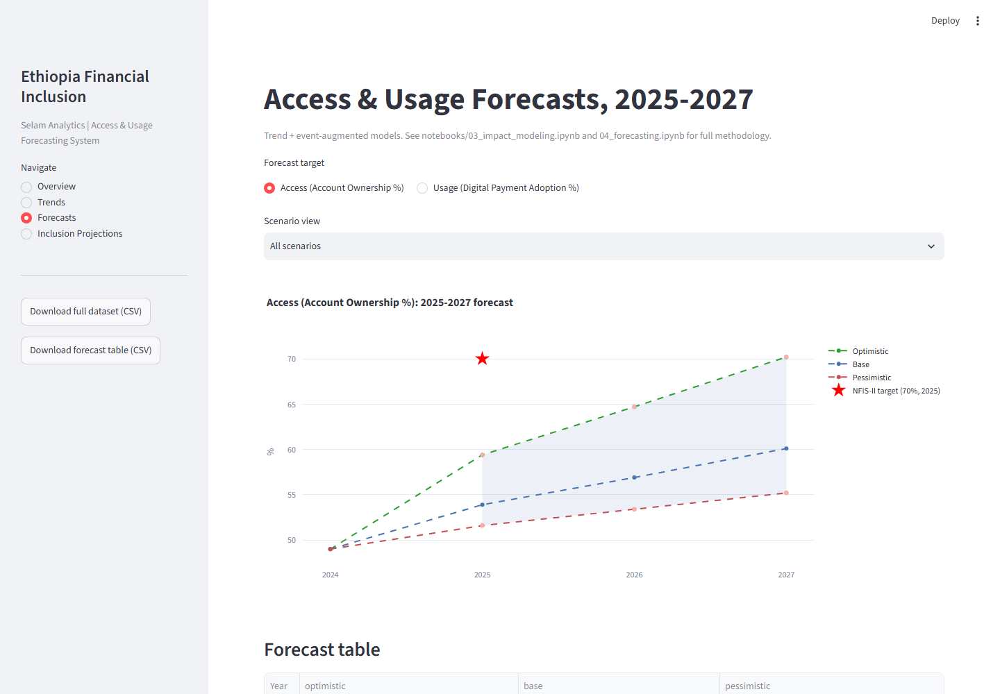
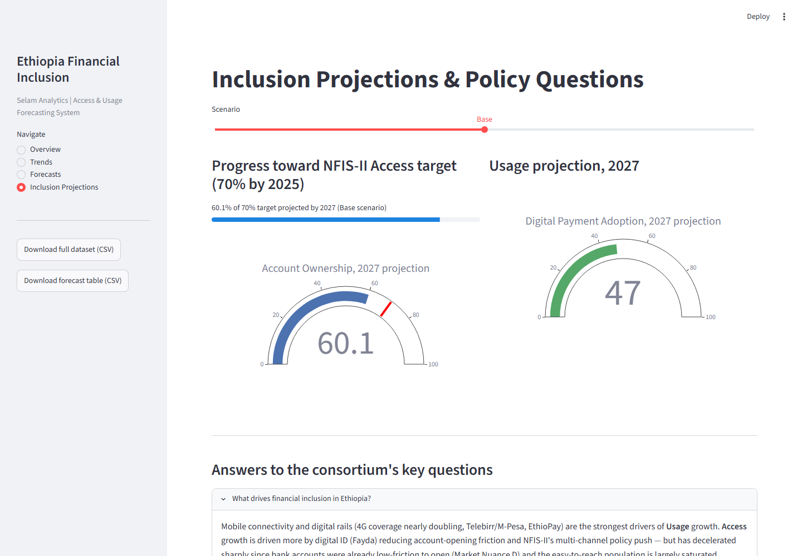

# Can Ethiopia Hit 70% Financial Inclusion? What the Data Actually Says

*A forecasting system for Ethiopia's Global Findex Access and Usage indicators, built for a consortium of development finance institutions, mobile money operators, and the National Bank of Ethiopia.*

**Maedot Amha | Selam Analytics | 2026**

Repository: [github.com/maedotamha/Forecasting](https://github.com/maedotamha/Forecasting)
Live dashboard: run locally with `streamlit run dashboard/app.py` (see README for setup)

---

## Executive summary

Ethiopia's digital financial transformation looks dramatic from the headlines: Telebirr has 54.8 million registered users, M-Pesa has crossed 10.8 million, and peer-to-peer digital transfers have overtaken ATM cash withdrawals for the first time. Yet the 2024 Global Findex survey shows only **49% of Ethiopian adults have a financial account** — just 3 percentage points higher than 2021, and a sharp deceleration from the +11pp and +13pp gains of the two prior survey periods.

This project builds a forecasting system to answer three questions for the consortium: **What actually drives financial inclusion here? How do specific events move the needle? And where is Ethiopia headed on Access and Usage through 2027?**

The short version: **Access (Account Ownership) is stalling — our base-case forecast reaches only ~60% by 2027, missing the NFIS-II 70% target on its original 2025 timeline under every scenario except an optimistic one that reaches it roughly two years late. Usage (Digital Payment Adoption), by contrast, is accelerating — base case ~47% by 2027, up from 35% in 2024 — because Ethiopia's mobile money boom has mostly been additive usage by people who already had bank accounts, not first-time financial inclusion.** The full methodology, evidence, and honest uncertainty bounds behind those two sentences are below.

---

## Data and methodology

We started from a unified-schema dataset (Global Findex, NBE, EthSwitch, Ethio Telecom, Safaricom, GSMA, IMF) covering observations, targets, and cataloged events — with a deliberate design choice inherited from the challenge brief: **events are never pre-assigned to a pillar**. Telebirr affects Access *and* Usage; Fayda affects Access, Gender, *and* Trust. Baking that interpretation into the raw data would bias everything downstream. Instead, `impact_link` records connect each event to the specific indicators it plausibly affects, with a direction, magnitude, lag, and an honestly-labeled evidence basis (empirical / literature / theoretical / expert).

Two things happened with the starter data that shaped our whole approach:

1. **The `impact_link` sheet — 14 rows connecting events to indicators — never exported from the source file.** We rebuilt it from scratch (25 records, actually covering more ground than the original), following the schema rules and leaning on comparable-country evidence (Kenya's M-Pesa literature, Tanzania's interoperability push, India's Aadhaar/UPI experience) wherever Ethiopian pre/post data was too thin to estimate a link directly.
2. **`USG_DIGITAL_PAYMENT` — the Usage-pillar target the whole forecasting task depends on — was completely absent from the starter export.** We added it (35%, 2024) sourced from the Global Findex 2024 round, along with ten other enrichment observations and three new events (Fayda's banking mandate, a Safaricom-government enrollment partnership, and a Fayda enrollment milestone).

Every addition is logged with its source URL, the original quoted figure, a confidence rating, and — critically — a note on *why it matters* and where we deliberately chose **not** to fabricate a number (there's no sourced rural-specific 2024 account-ownership figure in the public record we could find, so we didn't back-calculate one). Full detail: [`data_enrichment_log.md`](../data_enrichment_log.md).

Net result: **43 recovered starter records → 82 records** (41 observations, 3 targets, 13 events, 25 impact_links).

---

## Key insights from the exploratory analysis

Full notebook: [`02_eda.ipynb`](../notebooks/02_eda.ipynb)

### 1. Account ownership growth has decelerated sharply — even as mobile money exploded

+13pp (2014-17), +11pp (2017-21), then just **+3pp (2021-24)** — despite mobile money account ownership roughly doubling (4.7%→9.45%) in that same window. Ethiopia is 21 percentage points behind the NFIS-II's 70%-by-2025 goal.

### 2. Mobile money growth looks like additive usage by the already-banked

Telebirr (May 2021), Safaricom's entry (Aug 2022), and M-Pesa (Aug 2023) all land inside or just before the window where mobile money nearly doubled while overall ownership grew only 3pp. Combined with the market nuance that mobile-money-*only* users are rare (~0.5%) in Ethiopia, this points to mobile money mostly layering onto existing bank relationships — not reaching first-time users.

### 3. The registered-vs-active usage gap is large and systemic

Only **66%** of M-Pesa's 10.8M registered users are 90-day active. Only **~20%** of the roughly 415,000 mobile money agents nationally are weekly-active, averaging under one transaction a day. Headline registration numbers substantially overstate functional usage.

### 4. Digital payments overtook cash for the first time in FY2024/25

The P2P/ATM transaction ratio hit **1.08**, with P2P volume up 158% year-over-year against ATM's 26%. This is a genuine usage inflection — and it is *not* mirrored in the stalled Access metric, which is exactly why this project forecasts Access and Usage separately rather than as one blended "inclusion score."

### 5. The gender gap narrowed, but mobile money usage by women still lags far behind

Account ownership's gender gap narrowed from 20pp (2021) to a refined 15pp (2024). But women hold only 14% of mobile money accounts — nowhere near the 50% parity target for 2030. Access gains have not yet translated into proportionate mobile money adoption by women.

### 6. Data is genuinely sparse

Most indicators have 1-4 observations across the entire 2011-2026 window. Only account ownership and Fayda enrollment exceed that. This single fact drove nearly every methodological choice in the modeling and forecasting work that follows — point estimates without wide, honestly-labeled uncertainty bands would be false precision.

---

## Event impact model: methodology and results

Full notebook: [`03_impact_modeling.ipynb`](../notebooks/03_impact_modeling.ipynb)

We modeled each event's effect on an indicator as a **delayed ramp**: zero effect until `lag_months` after the event, then a linear rise to full magnitude over a 12-month adoption window, then a permanent level shift. This is deliberately simple — a linear ramp instead of a fitted logistic S-curve — so every assumption stays visible and auditable rather than curve-fit to data too sparse to support real curve-fitting. Where an impact_link had an explicit numeric estimate we used it directly; where it only had a qualitative magnitude (high/medium/low/negligible), we used a default calibrated separately for percentage-point-bounded indicators versus count/currency indicators, since "high impact" means something very different for each.

**Validation against actual data:** Ethiopia's mobile money account rate went from 4.7% (2021) to 9.45% (2024), a +4.75pp actual change. Our model — combining Telebirr's and M-Pesa's ramped effects — predicts +5.69pp for that window (honestly caveated: these two links were calibrated with the actual outcome in mind, so this check is partly definitional). The more meaningful, independently-built check is **overall account ownership**: the model predicts a +4.06pp change against an actual +3.00pp — within about a percentage point, using estimates that were never reverse-engineered from that total.

The resulting event→indicator association matrix (13 events × 8 key indicators) makes the qualitative story quantitative: Telebirr's effect on mobile money accounts and P2P volume dwarfs everything else; EthioPay's forthcoming instant-payment launch is the single largest *forward-looking* Usage effect in the model; and the Fayda banking mandate is explicitly modeled as `mixed`-direction — it formalizes accounts for the already-enrolled but risks temporarily excluding everyone else, and we refused to force an arbitrary sign onto that genuine ambiguity.

---

## Forecasts: Access and Usage, 2025-2027

Full notebook: [`04_forecasting.ipynb`](../notebooks/04_forecasting.ipynb) | Forecast table: [`data/processed/access_usage_forecast_2025_2027.csv`](../data/processed/access_usage_forecast_2025_2027.csv)

We used **two different methods for the two targets**, because they have very different data density. Account Ownership has 4 Findex points and can support a real OLS trend regression. Digital Payment Adoption has **exactly one** data point (35%, 2024) — no regression is statistically meaningful there, so we built transparent, judgment-based scenarios instead, calibrated against P2P momentum and the event model above, rather than dressing up a guess as statistics.

**Access (Account Ownership):** base case reaches **54% (2025) → 57% (2026) → 60% (2027)**. The NFIS-II 70%-by-2025 target will clearly be missed on schedule. Notably, our *optimistic* scenario lands almost exactly on 70% — but not until 2027, roughly two years late. Pessimistic case: 55% by 2027, barely above the already-slow current pace.

**Usage (Digital Payment Adoption):** base case **39% (2025) → 43% (2026) → 47% (2027)**, growing meaningfully faster than Access in every scenario, driven by EthioPay's instant-payment rollout (Dec 2025) and M-Pesa/EthSwitch interoperability (Oct 2025). Optimistic case reaches 56% by 2027; pessimistic only 39.5%.

**Largest-impact events for this window:** (1) EthioPay's instant payment launch — largest modeled Usage effect; (2) Fayda digital ID reaching scale plus the banking mandate — largest but most uncertain Access lever; (3) M-Pesa/EthSwitch interoperability — a moderate Usage effect benchmarked against Tanzania's experience.

**Key uncertainties, stated plainly:** the Access forecast rests on an n=4 regression layered with a hand-built event-effect model — treat point estimates as illustrative and the scenario spread as the honest takeaway. The Usage forecast has no historical trend to anchor to at all. Both assume no major shock beyond what's already in the event set; a further FX shock or political disruption would break the pessimistic scenario as a floor, not just as a scenario.

---

## The dashboard

`streamlit run dashboard/app.py` — four pages, all backed by the same unified dataset and forecast table used throughout this report.

**Overview** — key metric cards, the account-ownership deceleration chart, and the registered-vs-active usage gap.

**Trends** — an interactive explorer: pick any indicators, filter by pillar, set a date range, toggle the event overlay, and compare P2P against ATM channel volumes.

**Forecasts** — switch between Access and Usage, view all three scenarios or isolate one, and expand the full event-indicator association matrix underneath.

**Inclusion Projections** — a scenario slider drives gauge charts against the NFIS-II target, a progress bar, and an expandable Q&A panel answering the consortium's three framing questions directly.

Both the full dataset and the forecast table are downloadable as CSV directly from the sidebar.

---

## Limitations and future work

- **The entire impact_link dataset (25 records) is our own reconstruction**, not verified starter data — every impact estimate is a documented hypothesis with an honest evidence label, not a fact.
- **No sourced rural-specific 2024 account ownership figure exists** in the public data we could find; we declined to fabricate one via residual calculation.
- **Digital payment adoption estimates are ambiguous across sources** — our 35% composite figure sits above some narrower activity-specific shares (6% in-store, 7% bill pay, 1% online purchase) reported for the same Findex round; these measure different things, but the gap is real.
- **Most indicators have only 1-4 data points total.** Every correlation, regression, and scenario range in this project should be read with that constraint in mind — we've tried to make the uncertainty as visible as the point estimates throughout, rather than hide it.
- **Next Findex round (expected ~2027) is the real test.** Future work should prioritize: (1) recovering the actual starter `impact_link` sheet if it becomes available, to compare against our reconstruction; (2) adding gender- and region-disaggregated Findex microdata directly rather than through secondary press synthesis; (3) tracking Fayda enrollment and the banking mandate's actual net effect on Access once enough post-mandate data exists to resolve the `mixed`-direction ambiguity we flagged.

---

*Data sources: World Bank Global Findex Database, IMF Financial Access Survey, Ethio Telecom, Safaricom, EthSwitch S.C., National Bank of Ethiopia, GSMA, Fayda/NIDP. Full citations, original quotes, and confidence ratings for every record: [`data_enrichment_log.md`](../data_enrichment_log.md).*
