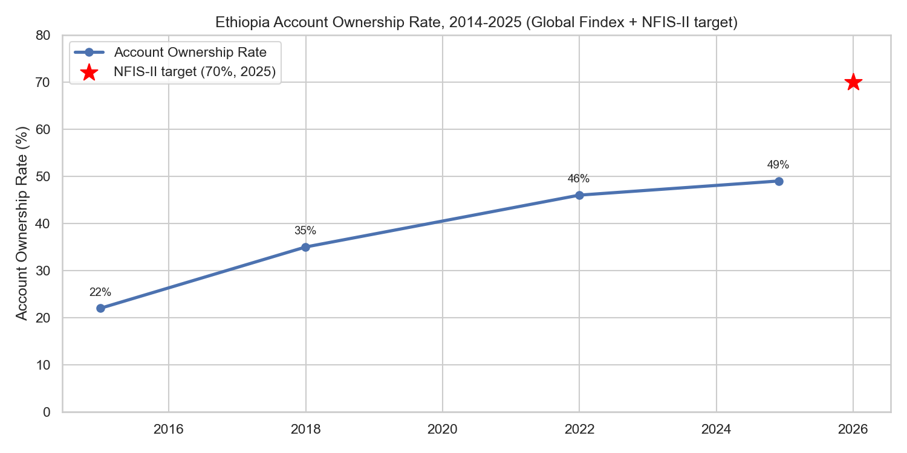
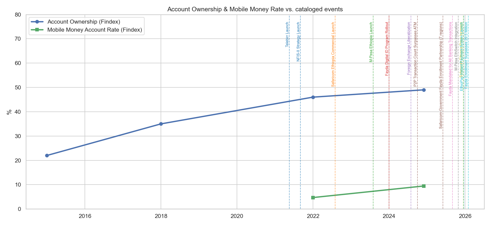
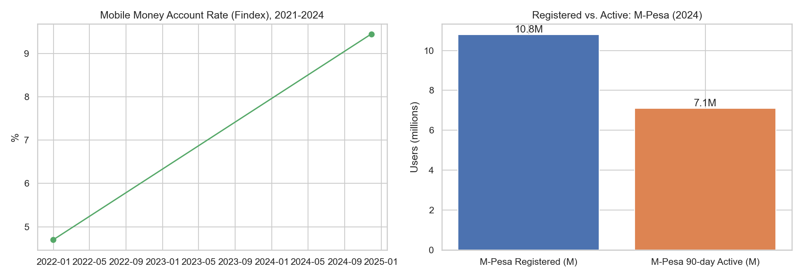
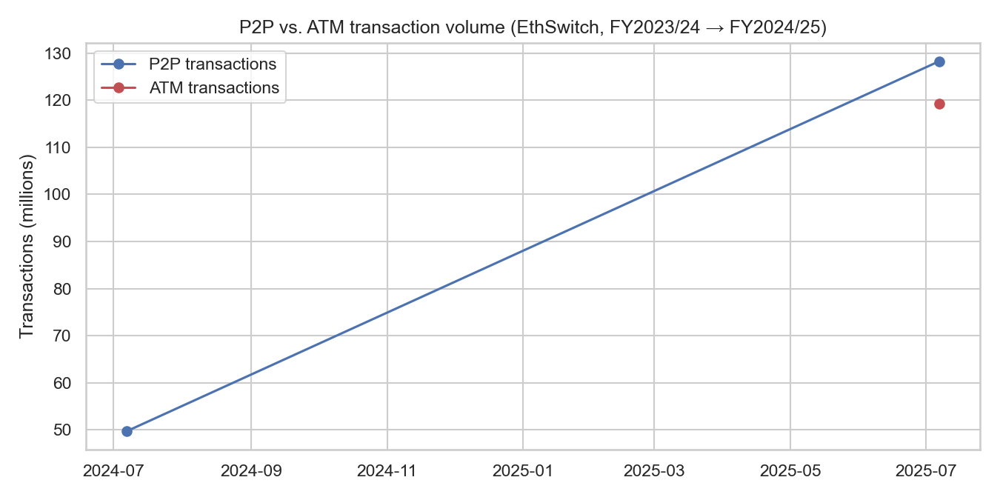
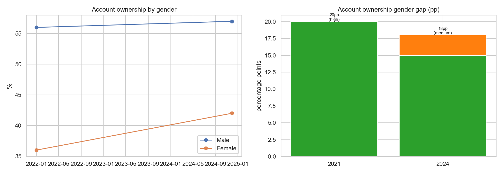
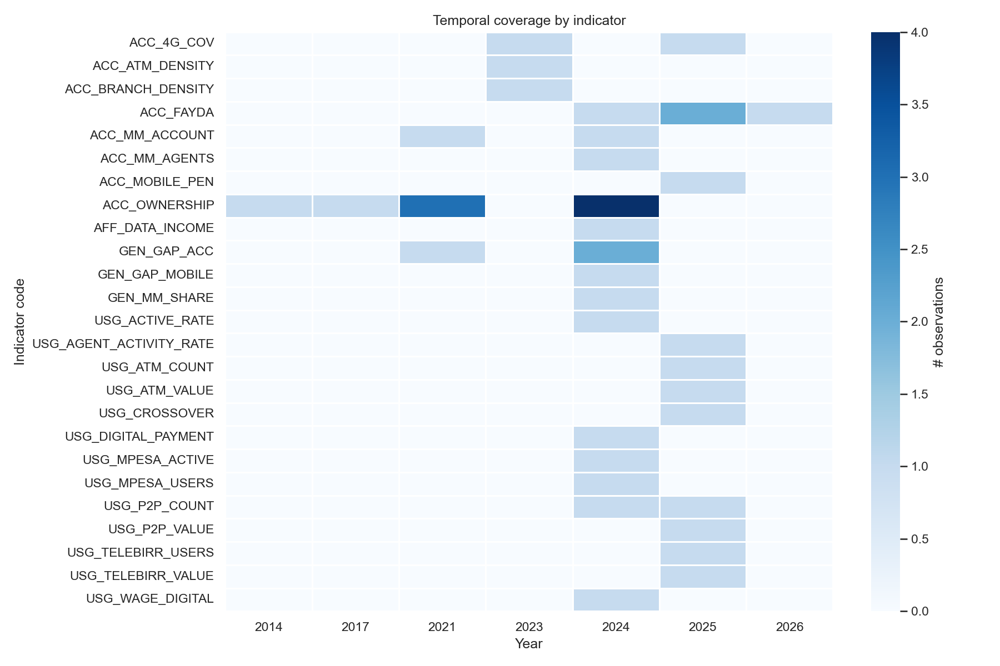

# Forecasting Financial Inclusion in Ethiopia — Interim Report

**Selam Analytics | Maedot Amha | 2026-07-21**

Repository: [github.com/maedotamha/Forecasting](https://github.com/maedotamha/Forecasting)

---

## 1. Data enrichment summary

The starter dataset was provided as a two-sheet workbook: a "data" sheet (observations, targets, events) and an "impact_links" sheet (event → indicator relationships). Only the data sheet exported successfully — **43 records** (30 observations, 3 targets, 10 events). The impact_links sheet (14 rows) did not export at all.

**What we did about it:**

| Addition | Count | Why |
|---|---|---|
| Reconstructed `impact_link` records | 25 | The original sheet was unrecoverable. We rebuilt it from the schema rules in `SCHEMA.md`, using empirical Ethiopian before/after data where available and comparable-country literature (Kenya M-Pesa, Tanzania interoperability, India Aadhaar/UPI) elsewhere — exactly as Task 3 instructs for events where local data is thin. |
| New observations | 11 | Filled real gaps: `USG_DIGITAL_PAYMENT` (35%, 2024) was **completely missing** despite being one of the two core forecasting targets. Also added 2024 gender-disaggregated account ownership, urban ownership, IMF FAS infrastructure density (ATMs, branches), mobile money agent counts/activity rates, and an updated Fayda enrollment figure. |
| New events | 3 | Safaricom-Fayda enrollment partnership, the Fayda banking mandate, and a Fayda enrollment milestone — all sourced from 2025/2026 press coverage. |

Every addition is logged with its source URL, original quoted text, a confidence rating, and a note on why it matters in **[`data_enrichment_log.md`](../data_enrichment_log.md)**, including the discrepancies we found (e.g., the starter data's estimated 18pp 2024 gender gap vs. the officially published 15pp figure) and where we chose *not* to fabricate a number (no sourced rural-specific 2024 account ownership figure exists, so we didn't back-calculate one).

Net result: **43 → 82 records.**

---

## 2. Key insights from exploratory analysis

Full analysis: [`notebooks/02_eda.ipynb`](../notebooks/02_eda.ipynb)

### Insight 1 — Account ownership growth has decelerated sharply, even as mobile money exploded

Growth per Findex period: **2014→2017 +13pp, 2017→2021 +11pp, 2021→2024 only +3pp** — despite mobile money account ownership roughly doubling (4.7%→9.45%) and Telebirr + M-Pesa combining for 65M+ registered users. Ethiopia is far off the NFIS-II 70%-by-2025 target (currently 49%).

### Insight 2 — Mobile money growth looks like additive usage by the already-banked, not new inclusion

Telebirr (May 2021), Safaricom's market entry (Aug 2022), and M-Pesa (Aug 2023) all precede or fall inside the 2021→2024 survey window in which mobile money nearly doubled while overall account ownership grew only 3pp. Combined with Market Nuance D — mobile-money-*only* users are rare (~0.5%) in Ethiopia — this points to mobile money mostly layering onto existing bank relationships rather than reaching first-time users.

### Insight 3 — The registered-vs-active usage gap is large and systemic

Only **66%** of M-Pesa's 10.8M registered users are 90-day active. Only **~20%** of the ~415,000 mobile money agents nationally are weekly-active, averaging fewer than 1 transaction per day. Headline registration figures (e.g. Telebirr's 54.8M) substantially overstate functional usage.

### Insight 4 — Digital payments overtook cash for the first time in FY2024/25

The P2P/ATM transaction ratio hit 1.08, with P2P volume up 158% YoY vs. ATM's 26% — a genuine usage inflection point, and one that is *not* mirrored in the stalled Access metric. This is the clearest evidence that Access and Usage are decoupling in Ethiopia and need to be forecast (and explained) separately.

### Insight 5 — The gender gap narrowed, but women's mobile money usage lags far behind

The account ownership gender gap narrowed from 20pp (2021) to 15pp (2024, refined figure). But women hold only 14% of mobile money accounts, far from the 2030 parity target of 50% — access gains have not yet translated into proportionate mobile money usage by women.

### Insight 6 — Data is genuinely sparse; correlation/forecasting work must carry wide uncertainty

Most indicators have only 1-4 observations across the entire 2011-2026 window; only account ownership and Fayda enrollment exceed that. This is the central constraint shaping our forecasting approach for Task 4 (trend + event-augmented models with explicit scenario ranges, not point forecasts).

---

## 3. Preliminary event-indicator relationships

We reconstructed 25 `impact_link` records covering 13 events. A first read (full detail and validation against actuals in Task 3):

- **Telebirr (2021)** → direct, high-magnitude effect on mobile money account rate (empirical: 0%→4.7% within the 2021 survey window) and an indirect, medium effect on overall account ownership (literature: comparable to Kenya's post-M-Pesa Findex gains).
- **M-Pesa entry (2023)** → similar direct effect on mobile money accounts, but only a low-magnitude indirect effect on overall ownership — second-mover entrants add less marginal inclusion once an incumbent exists and bank accounts are already low-friction to open.
- **FX Liberalization (2024)** → a rare *constraining* link: plausibly dampened new account formation among lower-income adults, a candidate explanation for the 2021-2024 slowdown (theoretical basis, not yet empirically isolated).
- **EthioPay / instant payments (Dec 2025)** → forward-looking, high-magnitude expected effect on P2P usage, benchmarked against India's UPI experience — this is one of the largest expected drivers in our Task 4 forecasts.

Roughly a third of these links are grounded in actual Ethiopian data (`empirical`); the rest are `literature`, `theoretical`, or `expert`-judgment based — a mix we report honestly rather than smoothing over.

---

## 4. Data limitations identified

- The **entire impact_link sheet is our own reconstruction**, not verified starter data — treat every impact estimate as a documented hypothesis, not a fact.
- **No sourced rural-specific 2024 account ownership figure** exists in the public sources we found; we did not fabricate one.
- **Digital payment adoption estimates are ambiguous across sources** — the 35% composite figure we use sits well above some narrower activity-specific shares (6% in-store, 7% bill pay, 1% online purchase) reported elsewhere for the same Findex round.
- **Two of the three new events have approximate dates**, sourced from press coverage rather than confirmed regulatory effective dates.
- **Most indicators have only 1-4 data points**, meaning correlation and trend analysis in this phase is directional and exploratory, not statistically confirmatory — this will directly shape how wide our Task 4 confidence intervals need to be.

---

## Next steps

Task 3 will formalize the event-impact model into a validated association matrix (checking, e.g., whether Telebirr's modeled impact on mobile money accounts matches the actual 4.7%→9.45% growth). Task 4 will build trend and event-augmented forecasts for Access and Usage through 2027 with explicit scenario ranges, and Task 5 will package all of this into an interactive Streamlit dashboard.
